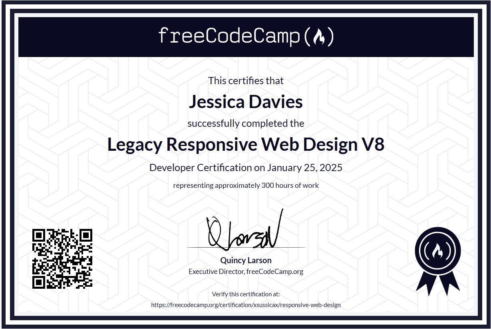

## Hi there 👋

<!--
Here are some ideas to get you started:

- 🔭 I’m currently working on ...
- 🌱 I’m currently learning ...
- 👯 I’m looking to collaborate on ...
- 🤔 I’m looking for help with ...
- 💬 Ask me about ...
- 📫 How to reach me: ...
- 😄 Pronouns: ...
- ⚡ Fun fact: ...
-->

I see you've stumbled across my GitHub profile. Allow me to introduce myself.

## About Me

My name is Jessica Davies, and I'm primarily a website developer, with experience in software development, with a Bachelor of Science (Hons. Computer Science) achievement.

As of 2025, I'm currently working towards a Master of Science (Hons. Adv Computer Science) achievement at the University of South Wales (USW) to expand my skillset and feel more qualified and confident going into the software industry.

My passion mainly revolves around web development and UI and UX design, but I have a few other things I like to do in my free time, such as art and writing.

## Current Project(s)

### University

Group project that involves analysing a fictional project and its goals, then figuring out whether or not the project should get the "OK".

### Personal work

I'm creating a text-based game that runs in the browser's console. More info should be released on this soon.

Also, a DOMKit testing survey is now avaliable! I need some testers (with experience in website development) to explore and provide feedback on the DOMKit documentation and repository.

If you'd like to learn more about this survey, read the Q&A <a href="https://jessicadavies.dev/articles/domkit-survey-qna/">here</a>.

If you are interested, the link to the survey is <a href="https://forms.cloud.microsoft/r/HPTnCXsfuq">here</a>.

## Languages and Tools

### Languages
- Python
- Java
- JavaScript
- HTML
- CSS
- React

### Tools
- Azure

## Certificates
Below are certificates for completing various online courses in my free time.

Completed on January 25th 2025

## Contact Me

Have an idea and want to work with me to bring it to life?

Email
- jessydavies@hotmail.com

Looking forward to connecting with you!
